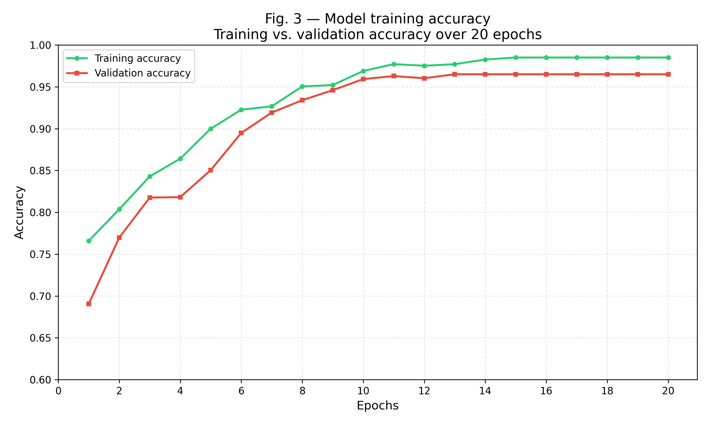
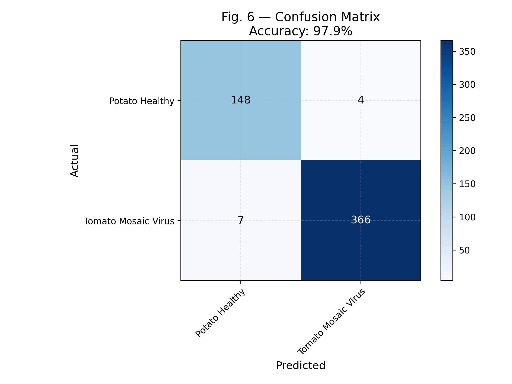

# 🌾 AgroVision – AI-Powered Crop Disease Detection & Advisory System

AgroVision is an AI-powered crop disease detection platform that combines Computer Vision and Generative AI to help identify crop diseases and provide actionable treatment recommendations. The system uses a MobileNet-V2 transfer learning model for image classification and integrates the Groq LLM API to generate disease explanations and treatment guidance.

## 🚀 Features

* Crop disease detection from leaf images
* Transfer Learning using MobileNet-V2
* AI-generated disease explanations
* Treatment and prevention recommendations
* Flask-based web application
* Real-time prediction interface

## 🎯 Model Performance

* Accuracy: **97.9%**
* Precision: **0.99**
* Recall: **0.98**
* Dataset Size: **525+ labeled crop leaf images**
* Classes: **Healthy / Diseased**

## 🛠️ Tech Stack

### Machine Learning

* TensorFlow
* Keras
* MobileNet-V2
* Transfer Learning

### Backend

* Flask
* Python

### AI Integration

* Groq LLM API

### Data Processing

* NumPy
* Pandas
* Pillow

### Frontend

* HTML
* CSS
* JavaScript

## 📊 Results

### Training Accuracy



### Confusion Matrix



## 📁 Project Structure

* `app.py` — Flask application server
* `basic_model.py` — Model training pipeline
* `compare_models.py` — Model comparison experiments
* `explain.py` — Groq LLM integration
* `crop_model.pkl` — Trained model
* `Crop_recommendation.csv` — Disease treatment recommendations

## ⚙️ Installation

```bash
pip install -r requirements.txt
cp .env.example .env
python app.py
```

Add your Groq API key in the `.env` file before running the application.

## 🌐 Run Locally

```bash
python app.py
```

Open:

http://127.0.0.1:5000

## 📌 Future Improvements

* Multi-crop disease classification
* Larger training datasets
* Mobile application support
* Cloud deployment
* Multilingual recommendations
* Real-time field image support
