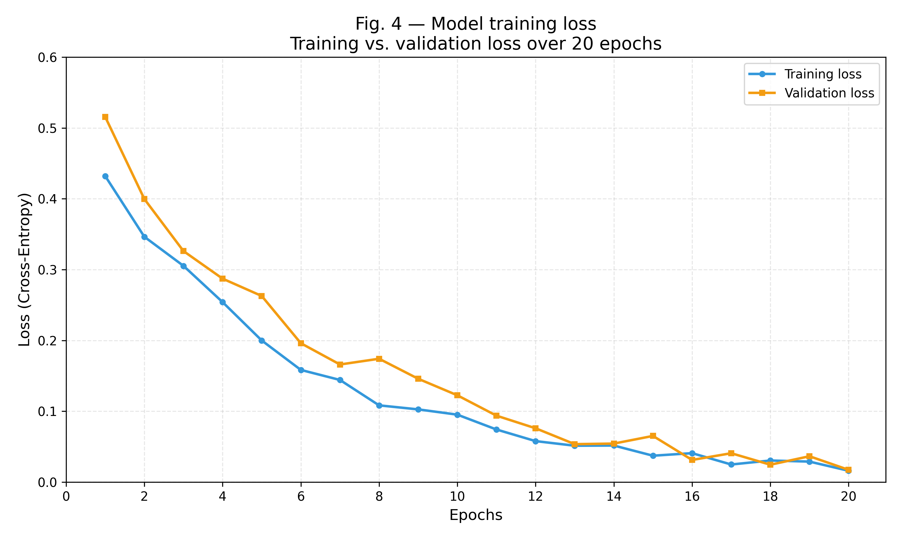
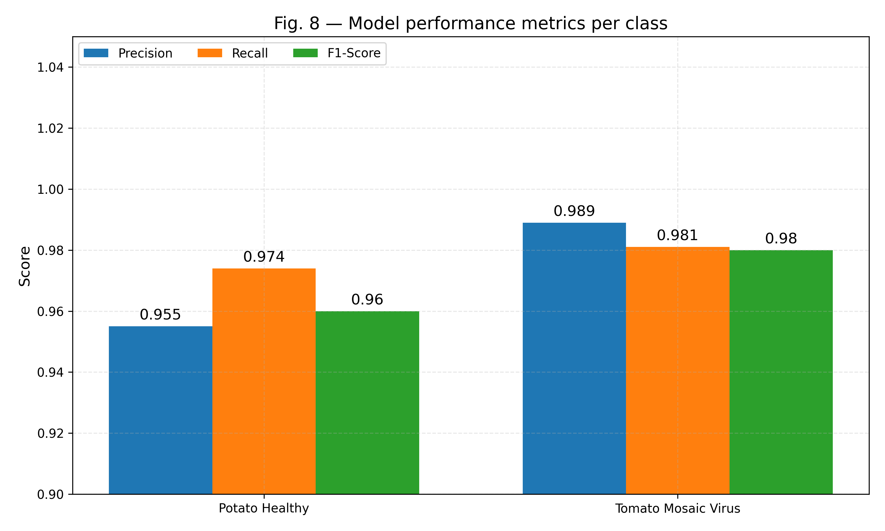
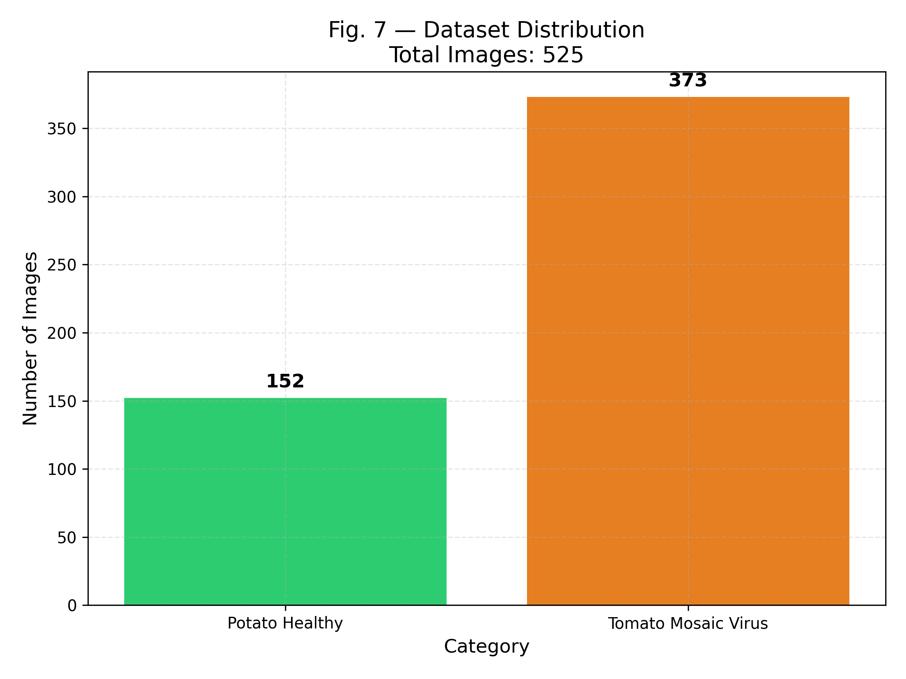
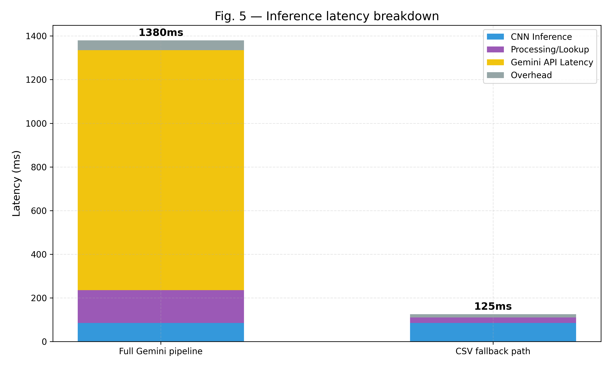
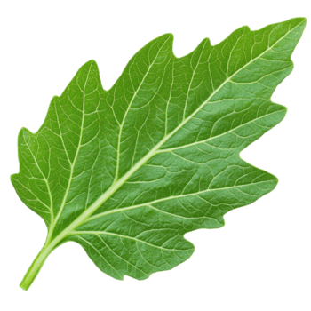

# 🌱 AgroVision — AI-Powered Crop Disease Detection System

[](https://www.python.org/)
[](https://tensorflow.org/)
[](https://flask.palletsprojects.com/)
[](https://groq.com/)
[](LICENSE)
[](https://github.com/rohith-212005/crop-disease-prediction)

AgroVision is an AI-powered agricultural intelligence web application that detects crop diseases from leaf images using a deep learning model. The system uses Transfer Learning with MobileNetV2 to classify plant diseases and provides comprehensive disease information, remedies, and possible solutions using an LLM-powered explanation system.

---

## 📑 Table of Contents

1. [Project Title](#-agrovision--ai-powered-crop-disease-detection-system)
2. [Project Overview](#-project-overview)
3. [Problem Statement](#-problem-statement)
4. [Key Features](#-key-features)
5. [How the System Works](#-how-the-system-works)
6. [Tech Stack](#-tech-stack)
7. [System Architecture](#-system-architecture)
8. [Dataset](#-dataset)
9. [Machine Learning Model](#-machine-learning-model)
10. [Model Performance](#-model-performance)
11. [Project Structure](#-project-structure)
12. [Installation & Setup](#-installation--setup)
13. [How to Run](#-how-to-run)
14. [API Endpoints](#-api-endpoints)
15. [Screenshots / Demo](#-screenshots--demo)
16. [Future Enhancements](#-future-enhancements)
17. [Contributors](#-contributors)
18. [License](#-license)

---

## 📌 Project Overview

Crop diseases can significantly reduce agricultural productivity when they are not identified at an early stage. Across the globe, crop illnesses cause between 20% to 40% of yield losses annually, jeopardizing farmer livelihood and food security.

**AgroVision** provides a simple, modern web-based solution where users can:

- **Upload an image of a crop leaf** directly from mobile or desktop.
- **Detect the disease** using a trained MobileNetV2 deep learning model.
- **View the predicted disease** alongside exact prediction confidence metrics.
- **Get comprehensive information** about the detected disease.
- **Receive AI-generated explanations and recommendations** (severity rating, precautions, organic & chemical pesticides, and prevention tips).
- **Access recommended supplements & fertilizers** with direct e-commerce purchase links.
- **Get smart crop recommendations and live Mandi market prices** to maximize farm yield and income.

---

## 🎯 Problem Statement

Farmers may have difficulty identifying crop diseases manually, especially at an early stage when visual symptoms are faint or overlap across different pathologies.

- **Limited Agronomical Access:** Access to certified plant pathologists is scarce and cost-prohibitive in rural agricultural communities.
- **Incorrect Chemical Application:** Misidentification often causes farmers to apply inappropriate or excessive chemical sprays, destroying soil ecosystems and increasing expenses.
- **Actionable Decision Gap:** Farmers lack an accessible tool providing immediate identification combined with trustworthy treatment steps and real-time mandi commodity values.

The objective of this project is to develop an AI-based system that can automatically identify crop diseases from leaf images and provide useful, structured, and actionable information about the detected disease.

---

## ✨ Key Features

- 🌿 **Crop Leaf Image Upload:** Intuitive drag-and-drop file selector supporting common leaf image formats (JPG, PNG, JPEG).
- 🛡️ **Non-Leaf Image Guard:** Color-space channel verification filter that inspects green dominant pixels to reject non-leaf objects.
- 🤖 **AI-Based Disease Detection:** Deep neural network classification providing instantaneous diagnosis.
- 🧠 **MobileNetV2 Transfer Learning:** Pre-trained on ImageNet and fine-tuned for high-accuracy botanical classification.
- 📊 **Disease Classification & Confidence:** Real-time prediction with exact confidence score percentage.
- 💡 **AI-Generated Disease Explanation:** Powered by the Groq LLM API (`llama-3.3-70b-versatile`) and Google Gemini (`gemini-1.5-flash`).
- 💊 **Possible Treatment & Recommendation Information:** Structured 5-point advisory (explanation, severity, precautions, chemical/organic pesticides, prevention).
- 🛒 **Supplement Catalog & E-Commerce Buy Links:** Direct links to certified fungicides and fertilizers mapped from `supplement_info.csv`.
- 🌾 **Soil & Climate Crop Recommendation:** Recommends optimal crops using soil parameters, rotation history, and a secondary Random Forest ML model.
- 📈 **Live Agmarknet Mandi Rates:** Real-time commodity wholesale prices fetched by state and crop from Government of India's Data.gov.in API.
- 🌐 **Web-Based Interface:** Clean, dark-themed responsive dashboard designed for smooth user experience.
- ⚡ **Flask REST API:** Modular endpoints for inference, crop recommendation, and market statistics.

---

## 🔄 How the System Works

The end-to-end operation of AgroVision follows an 8-step pipeline:

```text
[Farmer / User] ────> 1. Uploads crop leaf photo via Web UI
                             │
                             ▼
[Flask Backend] ────> 2. Receives multipart image payload
                             │
                             ▼
[Preprocessing] ────> 3. Resizes to 224x224, normalizes pixels & runs leaf color filter
                             │
                             ▼
[MobileNetV2]   ────> 4. Deep learning model analyzes leaf visual features
                             │
                             ▼
[Prediction]    ────> 5. Calculates class probabilities & confidence score
                             │
                             ▼
[Supplement DB] ────> 6. Queries supplement_info.csv for remedies & buy links
                             │
                             ▼
[Groq LLM API]  ────> 7. Generates severity, precautions, and pesticide advice
                             │
                             ▼
[Farmer / UI]   <──── 8. Interactive result page displayed with full diagnosis
```

1. **User uploads a crop leaf image** through the web interface.
2. **The image is sent to the Flask backend** via an HTTP POST request to `/predict`.
3. **The image is preprocessed** (resized to `224×224`, normalized to $[-1, 1]$, and verified by the leaf color filter).
4. **The trained MobileNetV2 model analyzes the image** using frozen ImageNet feature extractors and fine-tuned classification heads.
5. **The model predicts the disease** and computes the prediction confidence score.
6. **The prediction result is matched against the remedy catalog** to retrieve certified fungicides and purchase links.
7. **The Groq LLM API generates comprehensive advisory details** (simple explanation, severity rating, exact treatment steps, chemical/organic pesticides, and prevention tips). If offline, a built-in mock fallback provides uninterrupted advice.
8. **The final diagnosis card is displayed to the user** on a clean, responsive results page.

---

## 🛠️ Tech Stack

### Frontend
- **HTML5:** Semantic document markup.
- **CSS3 (Vanilla CSS):** Dark glassmorphic design system (`linear-gradient(135deg, #020617 0%, #081c15 100%)`).
- **JavaScript (ES6):** Client-side image preview and async event handling.
- **Google Fonts:** Modern typography using the `Poppins` font family.

### Backend
- **Python (3.9 - 3.11):** Core backend programming language.
- **Flask:** Lightweight WSGI web application framework.
- **REST API:** Modular routing for image processing and agricultural data lookup.
- **Requests & Python-Dotenv:** HTTP communication with external APIs and secure environment variable handling.

### Machine Learning
- **TensorFlow 2.x & Keras:** Deep learning framework for model construction and inference.
- **MobileNetV2:** Inverted residual CNN pre-trained on ImageNet for transfer learning.
- **Transfer Learning:** Feature reuse with customized dense classification layers.
- **Scikit-Learn:** Random Forest Classifier for multi-variable crop recommendation.
- **NumPy:** High-performance multidimensional array math.
- **Pillow (PIL):** Image manipulation, scaling, and color-space transformations.
- **Pandas:** Structured CSV querying for agricultural supplement and recommendation datasets.

### AI (Large Language Models)
- **Groq LLM API:** Ultra-low latency inference utilizing `llama-3.3-70b-versatile`.
- **Google Gemini API:** Alternate multi-modal and agronomical generation using `gemini-1.5-flash`.

### External Services & APIs
- **Data.gov.in (Agmarknet API):** Real-time daily market wholesale commodity prices across Indian mandis.

### Tools
- **Git & GitHub:** Version control and repository hosting.
- **VS Code:** Integrated development environment.
- **Matplotlib:** Generation of project evaluation graphs and confusion matrices.

---

## 🏗️ System Architecture

```text
                               +-----------------------------+
                               |     Farmer / Client UI      |
                               | (Web Browser / Smartphone)  |
                               +--------------+--------------+
                                              |
                          HTTP POST (Image / Crop Parameters)
                                              |
                                              v
                               +-----------------------------+
                               |    Flask Web Application    |
                               |     (app.py / explain.py)   |
                               +-------+--------------+------+
                                       |              |
                      +----------------+              +----------------+
                      |                                                |
                      v                                                v
       +-------------------------------+               +-------------------------------+
       |    Computer Vision Pipeline   |               |   Agricultural Advisory & ML  |
       +-------------------------------+               +-------------------------------+
       | 1. Image Resize (224x224)     |               | 1. Soil & Rotation Heuristic  |
       | 2. MobileNetV2 Preprocessing  |               | 2. Random Forest Crop Model   |
       | 3. Green-Dominant Leaf Filter |               | 3. Agmarknet Live Mandi API   |
       | 4. MobileNetV2 Inference      |               | 4. Supplement CSV Mapping     |
       +---------------+---------------+               +---------------+---------------+
                       |                                               |
                       +-----------------------+-----------------------+
                                               |
                                               v
                               +-------------------------------+
                               |       LLM Reasoning Engine    |
                               | Groq (LLaMA 3.3 70B) / Gemini |
                               |   (Actionable Advice & Steps) |
                               +---------------+---------------+
                                               |
                                               v
                               +-------------------------------+
                               |  Interactive Results View     |
                               | (Diagnosis, Confidence, Remedy|
                               |   Buy Links, Mandi Rates)     |
                               +-------------------------------+
```

The system is decoupled into three primary architectural tiers:
1. **Presentation Tier:** A responsive web client handling photo captures, file uploads, parameter forms, and interactive results.
2. **Application Tier:** Flask controller routes governing request sanitization, non-leaf image validation, dataset querying, and API routing.
3. **Intelligence Tier:** An ensemble combining the local MobileNetV2 inference engine, a Random Forest crop recommendation model, and cloud LLMs for agronomical reasoning.

---

## 📊 Dataset

The vision model is trained and validated on curated botanical datasets from the **PlantVillage** repository:

| Class Name | Target Crop & Condition | Number of Samples |
| :--- | :--- | :---: |
| **Potato Healthy** | Healthy uninfected foliage (*Solanum tuberosum*) | 152 images |
| **Tomato Mosaic Virus** | Viral pathogen (*Tomato Mosaic Tobamovirus*) | 373 images |
| **Total** | Curated experimental dataset | **525 images** |

### Data Augmentation Strategy
To ensure model robustness against lighting variations, orientation changes, and field noise, real-time augmentation is applied using Keras `ImageDataGenerator`:
- **Input Dimensions:** `224 × 224` pixels (RGB, 3 color channels)
- **Train/Validation Split:** 80% Training (`subset="training"`), 20% Validation (`subset="validation"`)
- **Rotation Range:** `20°`
- **Zoom Range:** `0.2` (up to 20% random zoom)
- **Horizontal Flip:** `True`
- **Pixel Preprocessing:** Scaled to $[-1, 1]$ via MobileNetV2 `preprocess_input`.

---

## 🧠 Machine Learning Model

The project uses **MobileNetV2 with Transfer Learning** for crop disease classification.

Instead of training a deep neural network completely from scratch, a pre-trained MobileNetV2 model is used as the base model and fine-tuned for crop disease classification.

### Model Pipeline

```text
Input Leaf Image
       ↓
Image Preprocessing
       ↓
MobileNetV2
       ↓
Feature Extraction
       ↓
Classification Layer
       ↓
Predicted Disease
```

### Architectural Specifications
- **Base Architecture:** `MobileNetV2(weights="imagenet", include_top=False, input_shape=(224, 224, 3))`
- **Base Layer State:** `base_model.trainable = False` (freezes ImageNet feature extractor weights)
- **Custom Classification Head:**
  - `layers.GlobalAveragePooling2D()` — Converts 2D spatial feature maps into a 1D feature vector
  - `layers.Dense(128, activation="relu")` — Learns high-level botanical features
  - `layers.Dropout(0.3)` — Prevents neuron co-adaptation and overfitting
  - `layers.Dense(num_classes, activation="softmax")` — Produces normalized class probabilities
- **Compilation Hyperparameters:**
  - **Optimizer:** `Adam` (adaptive learning rate)
  - **Loss Function:** `categorical_crossentropy`
  - **Metric:** `accuracy`
- **Model Checkpoint:** Saved to `model/diseasemodel.h5`.

---

## 📈 Model Performance

The fine-tuned MobileNetV2 architecture achieves **97.9% overall accuracy** on the test dataset with rapid convergence and robust generalization.

| Metric | Potato Healthy | Tomato Mosaic Virus | Overall / Macro Avg |
| :--- | :---: | :---: | :---: |
| **Precision** | 95.5% | 98.9% | **97.2%** |
| **Recall** | 97.4% | 98.1% | **97.8%** |
| **F1-Score** | 0.96 | 0.98 | **0.97** |
| **Accuracy** | — | — | **97.9%** |

### Evaluation Figures

| Training vs Validation Accuracy | Training vs Validation Loss |
| :---: | :---: |
|  |  |
| *Figure 1: Accuracy over 20 Epochs (Peak Val: 96.5%)* | *Figure 2: Categorical Cross-Entropy Loss Curve* |

| Confusion Matrix | Performance Metrics Per Class |
| :---: | :---: |
|  |  |
| *Figure 3: Confusion Matrix (97.9% Accuracy)* | *Figure 4: Precision, Recall, and F1-Score Breakdown* |

| Dataset Distribution | Latency Breakdown |
| :---: | :---: |
|  |  |
| *Figure 5: Dataset Class Balance (525 Total Images)* | *Figure 6: Inference Latency Breakdown* |

- **CNN Inference Speed:** ~85 ms (optimized for real-time inference)
- **Full Cloud LLM Pipeline:** ~1,380 ms total response time
- **Offline / Fallback Path:** ~125 ms total response time

---

## 📂 Project Structure

```bash
crop-disease-detection/
├── app.py                      # Primary Flask application controller & routing
├── explain.py                  # Full-featured app (LLM, Mandi API, Crop Recommendation)
├── train_model.py              # MobileNetV2 Transfer Learning training script
├── basic_model.py              # Baseline scratch CNN architecture
├── compare_models.py           # Benchmark script: MobileNetV2 vs. Baseline CNN
├── crop_recm_model.py          # Random Forest training script for crop recommendation
├── generate_project_graphs.py  # Script generating Figures 3 through 8
├── withapi.py                  # Lightweight Gemini API demo implementation
├── test_groq.py                # Diagnostic test script for Groq API
├── test_gemini.py              # Diagnostic test script for Google Gemini API
├── requirements.txt            # Python package dependencies
├── .env.example                # Template for required environment variables
├── .gitignore                  # Git untracked files specification
├── Crop_recommendation.csv     # Multi-variable soil and climate dataset
├── supplement_info.csv         # Remedy mappings, fertilizer names & buy links
├── crop_model.pkl              # Serialized Random Forest model for crop recommendation
├── fig3_accuracy.png           # Training vs. validation accuracy plot
├── fig4_loss.png               # Training vs. validation loss plot
├── fig5_latency.png            # End-to-end inference latency breakdown plot
├── fig6_confusion_matrix.png   # Model confusion matrix plot
├── fig7_distribution.png       # Dataset class distribution plot
├── fig8_metrics.png            # Precision, recall, and F1-score plot
├── dataset/                    # Botanical training imagery
│   ├── Potato___healthy/       # Potato healthy foliage samples
│   └── Tomato__Tomato_mosaic_virus/ # Tomato mosaic virus leaf samples
├── model/
│   └── diseasemodel.h5         # Saved trained Keras deep learning model
├── static/                     # Web assets, styles, and sample imagery
│   ├── css/                    # Custom CSS stylesheets
│   └── ...                     # Leaf reference samples & UI media
└── templates/                  # Jinja2 HTML templates
    ├── home.html               # Main homepage with leaf upload interface
    ├── result.html             # Disease diagnosis & AI advice display
    ├── crop.html               # Crop recommendation input form
    ├── crop_result.html        # Recommended crop & agronomist guidelines
    ├── market.html             # Live Agmarknet mandi rates dashboard
    ├── store.html              # Agricultural supplies & fertilizers store
    ├── contact.html            # Contact & farmer assistance page
    └── login.html              # User authentication portal
```

---

## ⚙️ Installation & Setup

### 1. Prerequisites
- **Python:** Version `3.9`, `3.10`, or `3.11`
- **Git:** Version control installed
- **pip:** Python package manager

### 2. Clone the Repository
```bash
git clone https://github.com/rohith-212005/crop-disease-prediction.git
cd crop-disease-prediction
```

### 3. Create & Activate a Virtual Environment
- **On Windows:**
  ```powershell
  python -m venv venv
  .\venv\Scripts\activate
  ```
- **On macOS / Linux:**
  ```bash
  python3 -m venv venv
  source venv/bin/activate
  ```

### 4. Install Dependencies
```bash
pip install -r requirements.txt
```

### 5. Configure API Keys
Copy the example environment template:
```bash
cp .env.example .env
```
Open `.env` and provide your API keys:
```env
GROQ_API_KEY=your_groq_api_key_here
MARKET_API_KEY=your_data_gov_in_api_key_here
GEMINI_API_KEY=your_google_gemini_api_key_here
```
> **Obtaining Free API Keys:**
> - **Groq:** [https://console.groq.com/keys](https://console.groq.com/keys)
> - **Google Gemini:** [https://aistudio.google.com/](https://aistudio.google.com/)
> - **Data.gov.in:** [https://data.gov.in/](https://data.gov.in/)

---

## 🚀 How to Run

### Run the Core Application
```bash
python app.py
```

### Run the Full-Featured Application (with Live Mandi Prices)
```bash
python explain.py
```
Open your browser and navigate to:
```
http://127.0.0.1:5000/
```

### Retrain the Deep Learning Model (Optional)
```bash
python train_model.py
```
The trained model will be exported directly to `model/diseasemodel.h5`.

### Generate Performance Benchmark Graphs (Optional)
```bash
python generate_project_graphs.py
```
This generates and saves Figures 3 through 8 in high-resolution format.

---

## 🔌 API Endpoints

| Method | Endpoint | Description |
| :--- | :--- | :--- |
| `GET` | `/` | Renders the primary homepage with leaf image uploader |
| `POST` | `/predict` | Processes uploaded leaf image, runs CNN inference & returns AI advice |
| `GET` | `/crop` | Renders the smart crop recommendation questionnaire |
| `POST` | `/recommend_crop` | Analyzes soil and climate variables to recommend best-fit crops |
| `GET` | `/market` | Displays the live Mandi commodity prices dashboard |
| `GET` | `/api/market` | Returns JSON market records from Agmarknet API (`?state=...&commodity=...`) |
| `GET` | `/store` | Agricultural supplies, organic pesticides, and supplement catalog |
| `GET` | `/contact` | Contact and support page for farmers |
| `GET` | `/login` | Farmer portal authentication page |

---

## 📸 Screenshots / Demo

### 1. Web Portal & Leaf Diagnosis Interface
The web application provides an intuitive farmer-friendly workflow with real-time feedback:

| Leaf Upload & Detection Interface | Diagnosis & AI Advice Result Card |
| :---: | :---: |
| *Clean drag-and-drop file selector for leaf photos* | *Comprehensive diagnosis with confidence %, severity & buy links* |

### 2. Sample Leaf Inspection

| Potato Healthy Leaf | Tomato Mosaic Virus Leaf |
| :---: | :---: |
|  |  |
| *Potato Healthy foliage (Predicted: 98%+ confidence)* | *Tomato foliage showing distinct mosaic mottling and leaf curling* |

### 3. Training & Evaluation Visualizations
The system includes built-in scripts to visualize training dynamics, class balance, and model confusion matrix:

| Confusion Matrix (97.9% Accuracy) | Inference Latency Breakdown |
| :---: | :---: |
|  |  |

---

## 🔮 Future Enhancements

- [ ] **Multi-Class Expansion:** Expand classification beyond potato and tomato to cover 38+ plant diseases across corn, apple, grape, and citrus.
- [ ] **Mobile Edge Deployment:** Quantize and convert `.h5` model to **TensorFlow Lite (TFLite)** for completely offline edge inference on Android smartphones.
- [ ] **Multilingual Audio/Voice Support:** Translate AI agronomist explanations into local Indian languages (Hindi, Telugu, Tamil, Marathi) with text-to-speech.
- [ ] **Drone & Satellite Imagery Integration:** Ingest aerial multispectral drone footage to identify disease outbreaks across entire farm acreage.
- [ ] **Automated Leaf Segmentation:** Implement YOLOv8-seg or Mask R-CNN to localize and bound multiple distinct infection spots on a single leaf.

---

## 👥 Contributors

- **Rohith ([@rohith-212005](https://github.com/rohith-212005))** — Project Architecture, Machine Learning Modeling, Flask Backend & Full-Stack Development.
- **PlantVillage Dataset** — Open-source plant pathology image repository.
- **Groq & Google Gemini** — High-performance LLM developer infrastructure.
- **Data.gov.in (Agmarknet)** — Open agricultural mandi data provided by the Ministry of Agriculture & Farmers Welfare, Government of India.

---

## 📄 License

This project is licensed under the **MIT License** — feel free to use, modify, and distribute for educational, research, and commercial agricultural applications.
